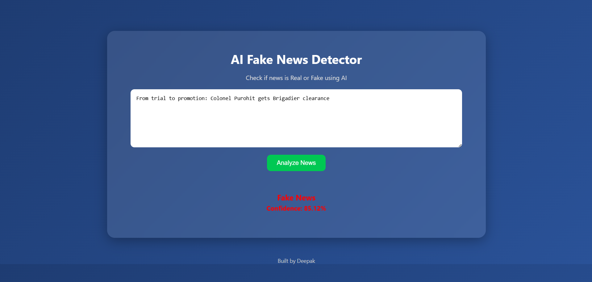

# 🧠 AI Fake News Detection System

🚀 A full-stack AI-powered web application that detects whether a news article is **Real or Fake** using Machine Learning and NLP.

---

## 🌐 Live Demo

- 🔗 Frontend: https://web-dev-experiments-roan.vercel.app/  
- 🔗 Backend: https://fake-news-backend-9c6y.onrender.com/  

---

## 📌 Overview

This project uses a trained **Machine Learning model** to analyze news text and classify it as **Real News ✅** or **Fake News ❌** along with a confidence score.

It combines:
- 🧠 AI (Machine Learning)
- ⚙️ Backend (Python + Flask)
- 🌐 Frontend (HTML, CSS, JavaScript)

---

## ✨ Features

- 📰 Paste any news and analyze instantly  
- 🤖 AI-based prediction (Real / Fake)  
- 📊 Confidence score display  
- 🎨 Modern UI  
- ⚡ Fast API response  

---

## 📸 Demo Screenshot

<p align="center">
  
</p>

<p align="center">
  
</p>

---

## 🛠️ Tech Stack

### 🔹 Backend
- Python
- Flask
- Scikit-learn
- Pandas, NumPy
- Joblib

### 🔹 Frontend
- HTML5
- CSS3
- JavaScript

---

## 🧠 Machine Learning Model

- Logistic Regression  
- TF-IDF Vectorizer  
- Accuracy: ~98%  

---

## ⚙️ Project Architecture
User Input → Frontend → Flask API → ML Model → Result → UI

---

## 📂 Project Structure


fake-news-detector/
│
├── backend/
│ ├── app.py
│ ├── train_model.py
│ ├── data_processing.py
│
├── frontend/
│ ├── index.html
│ ├── style.css
│ ├── script.js
│
├── .gitignore
└── README.md


---

## 🚀 Run Locally

```bash
git clone https://github.com/deepakdotdevs/Web-Dev-Experiments.git
cd fake-news-detector
pip install flask scikit-learn pandas numpy joblib flask-cors
cd backend
python app.py

⚠️ Note
Large dataset and model files are excluded due to GitHub size limits.

👨‍💻 Author

Deepak Jangid
🔗 https://github.com/deepakdotdevs
